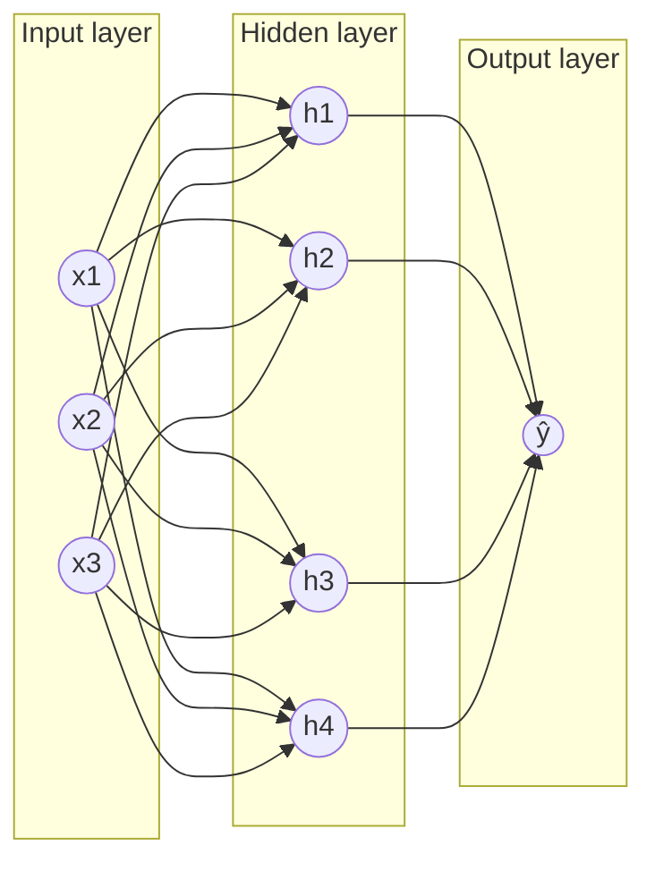

### 1. Deep Learning (DL) — Introduction

Deep Learning is a subfield of Machine Learning where we use **neural networks with many layers** to learn patterns from data.

Simple idea:
- ML = learn a function from data
- DL = learn that function using **multiple layers of representations** (features are learned automatically)

---

### Why Deep Learning?

Deep learning is powerful when:
- data is large (images, text, audio, logs)
- patterns are complex and not easy to hand-engineer
- feature engineering is difficult (vision, NLP)

---

### Why Deep Learning Became Popular (recently)

Deep learning existed for a long time, but it became practical and successful at scale because of:

- **More data:** internet + smartphones + sensors produced huge datasets (images/text/audio)
- **Better hardware:** GPUs/TPUs made training large networks much faster
- **Algorithm improvements:** ReLU, better initialization, BatchNorm, Dropout, better optimizers (Adam)
- **Large labeled datasets + benchmarks:** helped compare models and push progress
- **Strong tooling:** frameworks like TensorFlow / PyTorch + easy deployment
- **Pretraining + transfer learning:** train once on large data, then fine-tune for your task (BERT/GPT, vision backbones)

---

### ML vs Deep Learning (high-level)

Traditional ML (many cases):
- you design features manually (feature engineering)
- model learns on those features

Deep Learning:
- network learns features automatically in layers
- early layers learn simple patterns, later layers learn complex patterns

---

### Where Deep Learning is Used

- Computer Vision: image classification, object detection, face recognition
- NLP: translation, sentiment analysis, chatbots
- Speech: speech-to-text, voice assistants
- Recommendation systems
- Time series: forecasting, anomaly detection

---

### Key Building Block: Artificial Neural Network (ANN)

ANN is the foundation of deep learning.

You can think of an ANN as:

```text
input features → layers of neurons → output
```

ANN is made of **neurons** arranged in **layers**.

---

### 1) Neuron / Perceptron (Single Unit)

It mimics how a biological neuron works taking inputs, processing them, and giving an output.


A neuron takes inputs, multiplies by weights, adds bias, then applies an activation function.

#### Step 1: Linear part

$$
z = w^T x + b
$$

where:
- $x = [x_1, x_2, ..., x_n]$ are input features
- $w = [w_1, w_2, ..., w_n]$ are weights (learned)
- $b$ is bias (learned)

#### Step 2: Non-linear activation

$$
a = f(z)
$$

Activation $f$ makes the model non-linear (otherwise multiple layers collapse into one linear model).

---

### 2) Layers in ANN

ANN typically has:
- **Input layer**: receives features
- **Hidden layer(s)**: learn intermediate representations
- **Output layer**: produces prediction

Example:

```text
Input (x) → Hidden layer(s) → Output (ŷ)
```

More hidden layers = deeper network.

---

### Fully Connected ANN (1 Hidden Layer) — Diagram

In a **fully connected** (dense) network:
- every neuron in a layer connects to **every neuron in the next layer**
- each connection has a learnable **weight**
- each neuron has a learnable **bias** and an **activation function**



Matrix view (same idea as above equations):
- if input has $n$ features and hidden layer has $m$ neurons, then $W^{(1)} \in \mathbb{R}^{m\times n}$ and $b^{(1)} \in \mathbb{R}^{m}$
- if output layer has **1** neuron, then $W^{(2)} \in \mathbb{R}^{1\times m}$ and $b^{(2)} \in \mathbb{R}^{1}$

### 3) Forward Propagation (How prediction happens)

Forward pass means we compute output step-by-step from input → output.

For a 1-hidden-layer network:

$$
z^{(1)} = W^{(1)}x + b^{(1)}
$$

$$
a^{(1)} = f\left(z^{(1)}\right)
$$

$$
z^{(2)} = W^{(2)}a^{(1)} + b^{(2)}
$$

$$
\hat{y} = g\left(z^{(2)}\right)
$$

Here $f$ is hidden activation (like ReLU), and $g$ depends on the task (sigmoid/softmax/linear).

---

### 5) Loss Function (What the model tries to minimize)

Loss tells us how wrong the prediction is.

Common losses:

- Regression: Mean Squared Error (MSE)

$$
MSE = \frac{1}{N}\sum_{i=1}^{N}(y_i - \hat{y}_i)^2
$$

- Binary classification: Binary Cross Entropy (Log Loss)

$$
Loss = -\left(y\log(\hat{y}) + (1-y)\log(1-\hat{y})\right)
$$

- Multi-class: Categorical Cross Entropy

---

### 6) How ANN Learns (Training intuition)

ANN learns by adjusting weights and biases to reduce loss.

Training loop:
1. Initialize weights randomly
2. Forward pass → compute predictions $\hat{y}$
3. Compute loss $L$
4. Backpropagation → compute gradients
	- gradients tell the direction in which each weight should move to reduce the loss
	- if $\frac{\partial L}{\partial w} > 0$ then increasing $w$ increases loss → decrease $w$
	- if $\frac{\partial L}{\partial w} < 0$ then increasing $w$ decreases loss → increase $w$ 
5. Update parameters with Gradient Descent


### 7) Important Training Terms (ANN basics)

- **Epoch:** one full pass over the training dataset(forward+backward propagation)
- **Batch / Mini-batch:** smaller chunk of data used per update
- **Learning rate ($\alpha$):** step size of gradient descent

What happens if learning rate is high or low?

- **If $\alpha$ is too high:**
	- updates become too large
	- loss may oscillate (go up and down) or even diverge (blow up)
	- model may never settle at a good minimum

- **If $\alpha$ is too low:**
	- updates become very small
	- training becomes very slow (takes many epochs)
	- can get stuck for a long time on a plateau (loss decreases very slowly)

Simple intuition:
- learning rate is like step size while walking downhill; too big → you overshoot, too small → you move very slowly.
- **Overfitting:** model memorizes training data, performs poorly on new data
- **Regularization:** techniques to reduce overfitting (Dropout, L2, Early stopping)

---

### Summary (DL → ANN)

- Deep learning uses multi-layer neural networks.
- ANN is the core structure: neurons + layers + activations.
- Forward propagation makes predictions.
- Backpropagation + gradient descent updates weights to minimize loss.


